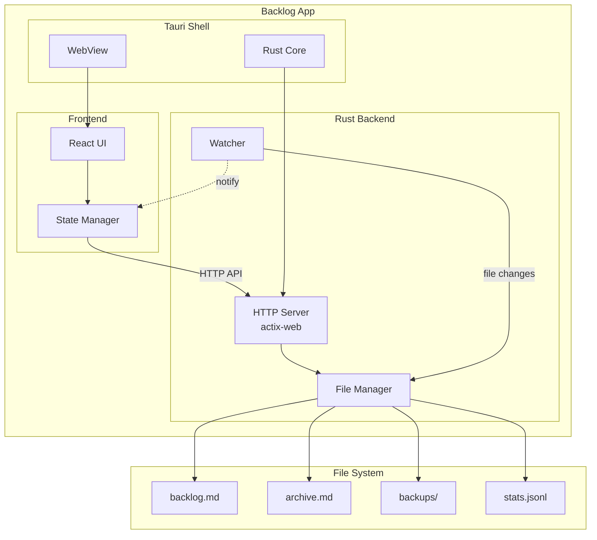
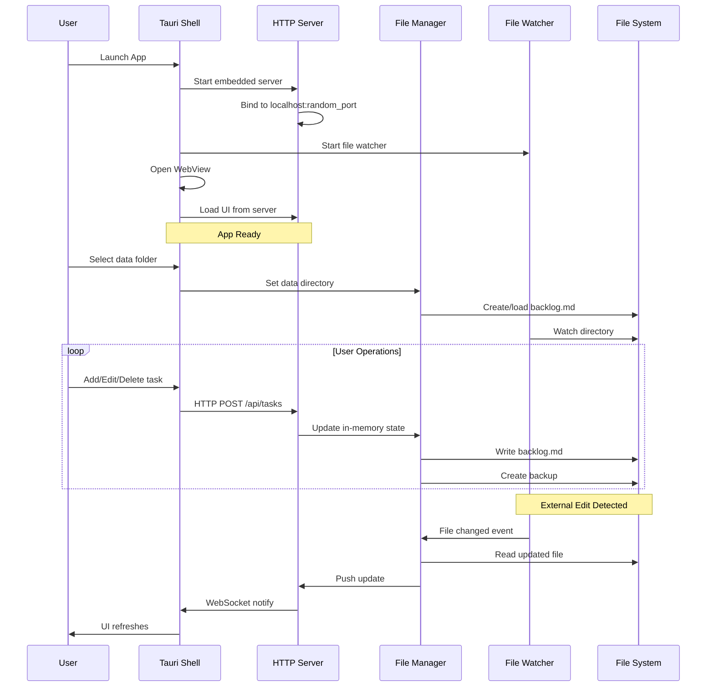
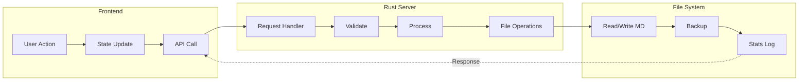
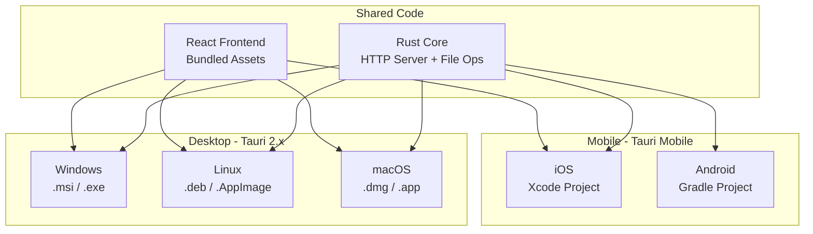
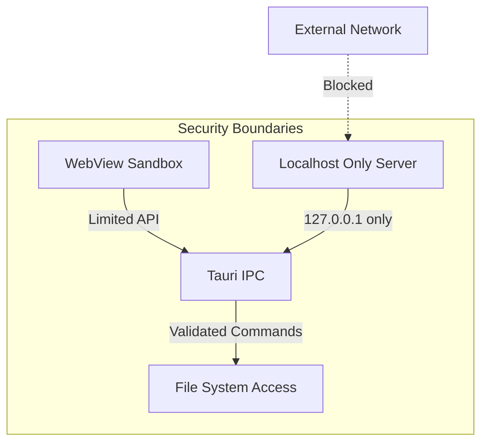
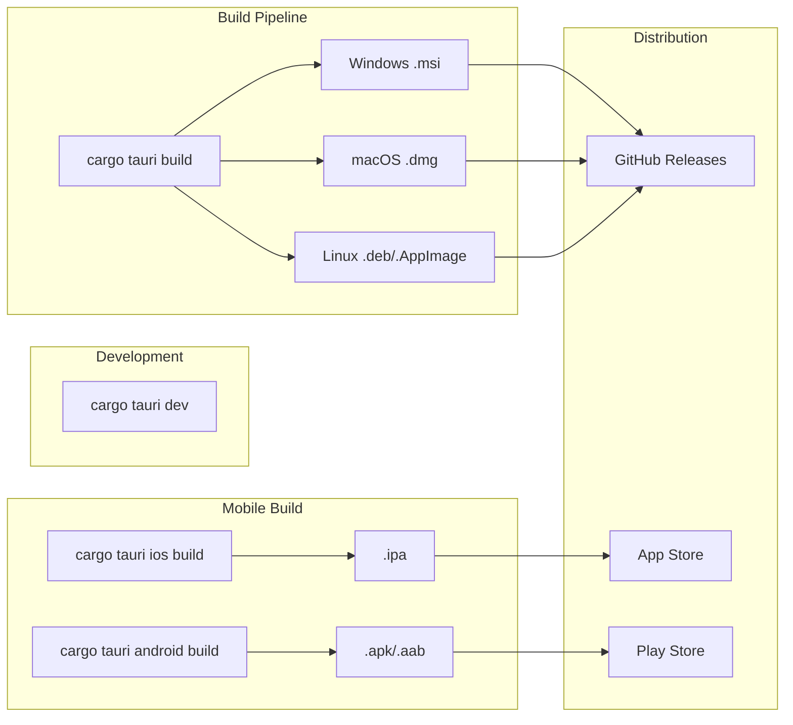

# Technical Design Document: Backlog App

## 1. Overview

**Backlog App** is a cross-platform desktop and mobile application wrapping the Personal Backlog web application. It provides a native app experience while maintaining the core philosophy: your tasks live in plain Markdown files you control.

### 1.1 Goals

- **Cross-platform**: Windows, Linux, macOS, iOS, Android (tablets)
- **Offline-first**: No internet required, ever
- **File-based persistence**: Data stored as Markdown files in user-chosen directory
- **Native experience**: System tray, notifications, keyboard shortcuts
- **Zero dependencies**: Single executable, no runtime requirements

### 1.2 Non-Goals

- Cloud sync (use external tools: Dropbox, git, Syncthing)
- Multi-user collaboration
- Mobile phone optimization (tablet-focused for mobile)

## 2. Architecture



### 2.1 Component Overview

| Component | Technology | Purpose |
|-----------|------------|---------|
| Shell | Tauri 2.x | Native window, system integration |
| HTTP Server | actix-web | API endpoints for CRUD operations |
| File Manager | Rust std::fs | Read/write Markdown files |
| File Watcher | notify-rs | Detect external file changes |
| Frontend | React (bundled) | User interface |

## 3. Detailed Design

### 3.1 Application Lifecycle



### 3.2 HTTP API Endpoints

The embedded server exposes the same API as the original Python server:

| Endpoint | Method | Description |
|----------|--------|-------------|
| `/` | GET | Serve static UI files |
| `/api/load` | GET | Load backlog data |
| `/api/save` | POST | Save backlog data |
| `/api/backup` | POST | Create backup |
| `/api/history` | GET | Get edit history |
| `/api/stats` | GET/POST | Statistics operations |
| `/api/archive` | POST | Archive completed tasks |

### 3.3 Data Flow



### 3.4 File Format Compatibility

The app maintains 100% compatibility with the original backlog.md format:

```markdown
# Backlog

<!-- SECTION: ENTRIES -->

- [ ] [P0] Task title *(due: 2025-06-01, priority: P0, progress: 50)*
  > Task body with **rich text** details.
  - [x] Subtask 1 *(priority: P0, progress: 100)*
  - [ ] Subtask 2 *(priority: P1, progress: 0)*

<!-- SECTION: HISTORY -->

| Timestamp | Item ID | Action | Details |
|-----------|---------|--------|---------|
| 2025-05-10T14:32:00Z | i-m1 | status_changed | open → done |

<!-- SECTION: INTEGRITY -->

<!-- saved: 2025-05-10T14:35:12Z | checksum: sha256:abc... | entries: 3 -->
```

## 4. Cross-Platform Strategy



### 4.1 Platform-Specific Considerations

| Platform | Data Location | Special Features |
|----------|---------------|------------------|
| Windows | `%APPDATA%\backlog-app\` or user-selected | System tray, jump list |
| Linux | `~/.local/share/backlog-app/` or user-selected | Desktop file, system tray |
| macOS | `~/Library/Application Support/backlog-app/` or user-selected | Menu bar, Spotlight |
| iOS | App Documents folder | Files app integration |
| Android | App-specific storage | SAF for external folders |

### 4.2 Mobile Adaptations

For iOS and Android tablet support:

- Touch-optimized UI (larger tap targets)
- Swipe gestures for common actions
- Virtual keyboard handling
- Platform file picker integration
- Background sync when app is suspended

## 5. Security Considerations



- **No network exposure**: HTTP server binds only to `127.0.0.1`
- **Tauri security**: CSP, IPC allowlist, capability-based permissions
- **File access**: Only user-approved directories
- **No telemetry**: Zero data collection

## 6. Project Structure

```
backlog-app/
├── doc/
│   └── TDD.md                 # This document
├── src-tauri/
│   ├── Cargo.toml             # Rust dependencies
│   ├── src/
│   │   ├── main.rs            # Tauri entry point
│   │   ├── server/
│   │   │   ├── mod.rs         # HTTP server module
│   │   │   ├── handlers.rs    # API handlers
│   │   │   └── routes.rs      # Route definitions
│   │   ├── file_manager/
│   │   │   ├── mod.rs         # File operations
│   │   │   ├── parser.rs      # Markdown parser
│   │   │   └── writer.rs      # Markdown writer
│   │   ├── watcher/
│   │   │   └── mod.rs         # File system watcher
│   │   └── state.rs           # Application state
│   ├── tauri.conf.json        # Tauri configuration
│   └── capabilities/          # Tauri v2 capabilities
├── src/                       # Frontend (copied from backlog)
│   ├── index.html
│   ├── app.jsx
│   ├── styles.css
│   └── ...
├── src-mobile/                # Mobile-specific overrides
│   ├── ios/
│   └── android/
├── package.json
└── README.md
```

## 7. Technology Stack

### 7.1 Core Dependencies

| Dependency | Version | Purpose |
|------------|---------|---------|
| tauri | 2.x | Application framework |
| actix-web | 4.x | HTTP server |
| tokio | 1.x | Async runtime |
| notify | 6.x | File system watcher |
| serde | 1.x | Serialization |
| pulldown-cmark | 0.10.x | Markdown parsing |

### 7.2 Frontend

The frontend is embedded from the original backlog project:
- React (via CDN or bundled)
- Single HTML file with inline JS/CSS
- No build step required for development

## 8. Build & Distribution



### 8.1 Build Commands

```bash
# Development
cargo tauri dev

# Desktop builds
cargo tauri build                    # Current platform
cargo tauri build --target x86_64-pc-windows-msvc
cargo tauri build --target x86_64-apple-darwin
cargo tauri build --target x86_64-unknown-linux-gnu

# Mobile builds
cargo tauri ios init
cargo tauri ios build
cargo tauri android init  
cargo tauri android build
```

## 9. Implementation Phases

### Phase 1: Core Desktop App (MVP)
- [ ] Tauri project setup
- [ ] Embedded HTTP server (actix-web)
- [ ] File manager (read/write backlog.md)
- [ ] Integrate existing React UI
- [ ] Basic file watcher

### Phase 2: Desktop Polish
- [ ] System tray integration
- [ ] Keyboard shortcuts
- [ ] Auto-start option
- [ ] Native notifications
- [ ] Multiple backlog files support

### Phase 3: Mobile Support
- [ ] iOS build configuration
- [ ] Android build configuration
- [ ] Touch-optimized UI adjustments
- [ ] Platform file picker integration

### Phase 4: Distribution
- [ ] CI/CD pipeline (GitHub Actions)
- [ ] Auto-update mechanism
- [ ] Code signing (macOS, Windows)
- [ ] App store submissions (iOS, Android)

## 10. Risks & Mitigations

| Risk | Impact | Mitigation |
|------|--------|------------|
| Tauri mobile is newer | Medium | Start with desktop, validate mobile early |
| WebView inconsistencies | Low | Test on all platforms, use polyfills |
| File system permissions (mobile) | Medium | Use platform-specific APIs, SAF on Android |
| App store approval | Medium | Follow guidelines, prepare documentation |

## 11. Success Metrics

- Single executable < 15MB (desktop)
- Cold start < 2 seconds
- File operations < 100ms
- Memory usage < 100MB
- Works completely offline
